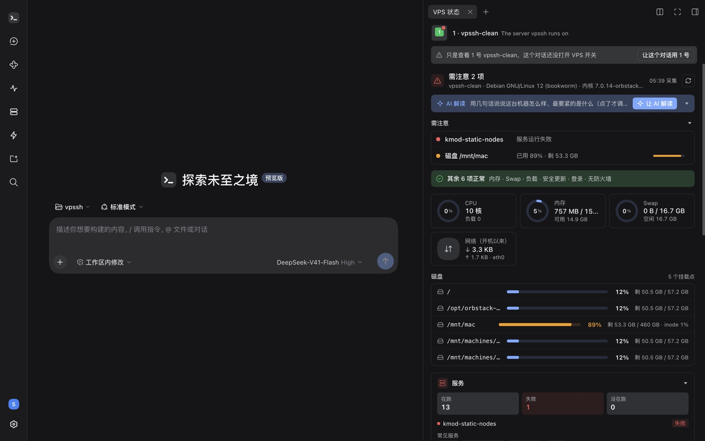
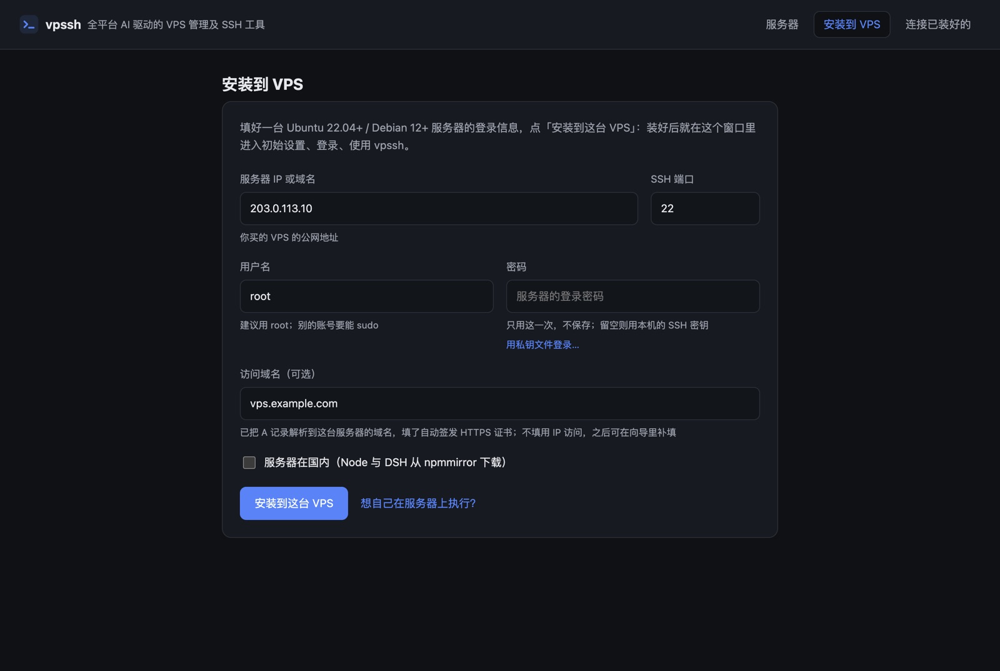
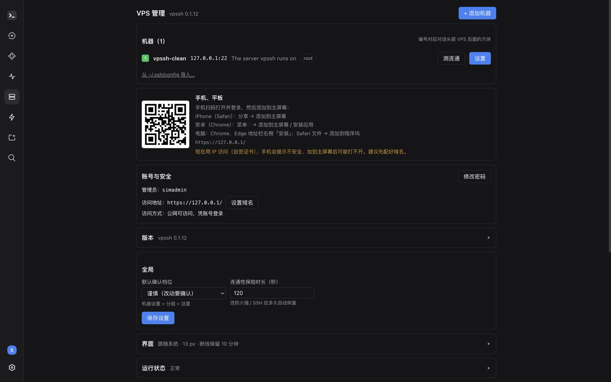

<p align="center">
  
</p>

<h1 align="center">vpssh</h1>

<p align="center">
  <b>AI-driven VPS management and SSH tool for every platform</b><br>
  Runs on your own VPS: say what you want and the AI manages the server; terminal, files and status live in one web page you can open on your computer, phone or tablet.
</p>

<p align="center">
  <a href="https://github.com/AIcivilization/vpssh/releases/latest"></a>
  <a href="https://www.npmjs.com/package/vpssh"></a>
  <a href="https://github.com/AIcivilization/vpssh/actions/workflows/release.yml"></a>
  <a href="https://github.com/AIcivilization/vpssh/releases"></a>
  <a href="LICENSE"></a>
  <br>
  
  
  
  
</p>

<p align="center">
  <a href="#download-and-install">Download &amp; install</a> ·
  <a href="#features">Features</a> ·
  <a href="#using-it">Using it</a> ·
  <a href="#security">Security</a> ·
  <a href="#faq">FAQ</a> ·
  <a href="README.md">中文</a>
</p>

<p align="center">
  
</p>

## What is vpssh

You rent a VPS, and then comes the endless SSHing, looking up commands, editing configs and reading logs. vpssh turns that into a **conversation**: in a web page you say "install nginx and reverse-proxy a.com to 3000" or "find out why the disk is full", and the AI investigates and does it, asking you to approve changes by risk level.

It is also a complete **SSH tool**: a machine list, web terminals that survive disconnects, file browsing and transfer, and a server status dashboard, for one machine or many.

vpssh runs on your own server. There is no server of ours, and the AI uses your own model key. Free and open source (MIT).

## Highlights

- **The AI does the work, you make the call**: read-only checks just run; changes are approved by risk level, and dangerous ones always ask first. Firewall and SSH changes, the kind that can lock you out, also come with an automatic rollback timer.
- **One web page, every device**: your computer, phone and tablet open the same page, with the same machines and the same conversations. On a phone it opens on the live server status; add it to the home screen and it works like an app.
- **The AI never holds your SSH keys**: private keys live in a separate `vpssh-keyd` service; the process the AI runs in cannot read them, only ask for a login to be signed.
- **Common tasks without tokens**: look things up or install Docker / Nginx / fail2ban and more from ready-made recipes, with the plan shown before anything runs; `/vps-help` lists every free command.
- **Gets along with existing sites**: a machine that already serves a site (e.g. dsh-vps with Caddy on 80/443) is fine. vpssh adds one line to Caddy's config; with a domain both share 443, told apart by name.
- **Fearless upgrades**: one-click upgrades back up first and return to the previous version if anything fails; uninstalling keeps your data by default.
- **Chinese and English**: the interface, the installer and the command line follow the system language.

## Download and install

Server: **Ubuntu 22.04+ or Debian 12+**, root or an account that can sudo, ports 80 and 443 open. Pick any one of these:

| Edition | For | Download / command |
|---|---|---|
| **Desktop · macOS** | No typing: fill in a form, then use vpssh in its own window | `vpssh-<version>-mac-arm64.dmg` (Apple silicon) / `-mac-x64.dmg` (Intel) from [Releases](https://github.com/AIcivilization/vpssh/releases/latest) |
| **Desktop · Windows** | Same | `vpssh-<version>-win-x64.exe` from [Releases](https://github.com/AIcivilization/vpssh/releases/latest) |
| **Server** | You are used to working on the server over SSH | One-line command, or the `vpssh-<version>-server-linux.tar.gz` package from [Releases](https://github.com/AIcivilization/vpssh/releases/latest) |
| **Command line** | You have Node.js and like one command | `npx vpssh install root@your-server-ip` |

### Desktop app (recommended)



1. Download, install and open vpssh.
2. Enter the server IP, SSH port, user name and password (or choose a key file); add a domain if you have one, and tick "Server in mainland China" if it is.
3. Click "Install on this VPS" and watch the progress (usually 3–8 minutes; a dropped connection reconnects by itself).
4. First-time setup opens right in the window: create the admin account, sign in, and you are in.

Next time the app opens straight on the last server, still signed in. The Server menu switches between servers, installs on another one or connects to one that is already installed.

- The password is used once and never saved.
- Over an IP address the app trusts only that server's own certificate (read over SSH during install), so there is no "not secure" warning.
- The builds are not signed with an Apple / Microsoft developer certificate yet: if the Mac says it cannot verify the app the first time, click "Open Anyway" under System Settings → Privacy & Security; on Windows, choose "More info → Run anyway".

<br clear="right">

### Server edition

**One-line command**: log in to the server over SSH and run (installs the latest release):

```bash
curl -fsSL https://github.com/AIcivilization/vpssh/releases/latest/download/install.sh | sudo bash
```

**Package**: when you want to inspect it first, pin a version or upload it yourself. Download `vpssh-<version>-server-linux.tar.gz` from [Releases](https://github.com/AIcivilization/vpssh/releases/latest) (the `.sha256` next to it is its checksum), then:

```bash
tar -xzf vpssh-0.1.12-server-linux.tar.gz
sudo bash vpssh-0.1.12/server/install.sh
```

Both take options (with the one-liner: `| sudo bash -s -- <options>`):

| Option | What it does |
|---|---|
| `--domain vps.example.com` | Use a domain (point its A record at the server first); HTTPS certificates are issued automatically. Without it: the public IP and a self-signed certificate, and you can set a domain in the web page later |
| `--mirror cn` | Server in mainland China: download Node and DeepSeek Harness from mirrors there |
| `--port <port>` | The port the browser uses (default 443; switches to 8443 when another site on the machine holds 443 and there is no domain) |
| `--ip <IP>` | Without a domain, use this IP (default: the detected public IP) |

The installer prints an address with a one-time token; open it for first-time setup. If a firewall (ufw, firewalld) is on, the needed ports are opened for you; a cloud provider's security group lives outside the machine, so open the port in its console (the installer tells you which).

### Command line (npx)

With [Node.js](https://nodejs.org) 18+ on your computer, this SSHes in for you, installs, and opens the browser when done:

```bash
npx vpssh install root@your-server-ip
```

Add `-i ~/.ssh/id_ed25519` for a key, `-p 2222` for another SSH port; `--domain`, `--mirror cn` and `--port` work here too. Later: `npx vpssh upgrade root@IP`, `npx vpssh uninstall root@IP`, `npx vpssh setup-url root@IP` (get the setup link again).

## Features

| | |
|---|---|
| **Manage servers by conversation** | Describe the job in plain words; the AI plans, runs and reports. Changes are approved by risk level: Careful (every change asks), Relaxed (only dangerous ones ask) or Fully automatic |
| **Many machines** | Machine list with groups and notes; the numbered squares in the conversation header pick which one a conversation works on; import from `~/.ssh/config` |
| **Server status** | CPU, memory, swap, disks, network, services, firewall, certificates, scheduled tasks, security updates, logins, with anything that needs attention on top; one click asks the AI for a short summary |
| **Web terminal** | Reconnects to the same session after a dropped connection or a closed page; works on phones too |
| **Files** | Browse, drag in to upload, right-click to download, double-click to edit; deletes go to the trash and edits are backed up first; right-click "Let the AI look at this file" |
| **Common tasks** | Ready-made recipes for lookups, installing common software and common fixes, with the plan shown first, no tokens spent |
| **Phone and tablet** | Opens on a live, auto-refreshing server status; scan a QR code to sign in, add it to the home screen for full-screen use |
| **Account and security** | Password sign-in with rate limiting; set, change or remove a domain at any time; restrict access to your own devices (WireGuard) |
| **Versions** | Check for updates and upgrade in one click from the web page, with automatic rollback on failure; uninstall from the web page too |

<p align="center">
  
</p>

## Using it

1. **First-time setup**: create the admin account; optionally a domain and a model API key (DeepSeek, OpenAI, Anthropic and others; you can also add it later under Settings → Models).
2. **The server itself is machine 1**, ready to manage right away. Add others under VPS Manager → Add machine in the left rail (IP, account, password; vpssh installs its own public key there).
3. **Say what you want in the conversation.** With one machine a new conversation works on it by default; with several, pick one with the numbered squares after "VPS" in the conversation header.
4. **Terminal and files**: the `>_` after "VPS" in the conversation header.
5. **"VPS status" on the right** keeps showing the current machine; the left rail also has "Server status", "VPS Manager" and "Common tasks".
6. **Free commands**: type `/vps-help` in the input box.

## Upgrade, rescue, uninstall

In the web page: VPS Manager → Version checks for updates and upgrades in one click; you can uninstall from VPS Manager too. On the server:

```bash
sudo vpssh upgrade      # to the latest release: backs up first, returns to the previous version on failure
sudo vpssh rollback     # back to before the last upgrade
sudo vpssh repair       # when the page does not open: restart services, rewrite the site, open ports
sudo vpssh status       # services and configuration at a glance
sudo vpssh setup-url    # get the first-time setup link again
sudo vpssh reset-admin  # forgot the admin password: run first-time setup again
sudo vpssh uninstall    # backs up first and keeps the data unless you add --delete-data
```

## Security

- The page sits behind a sign-in: password (scrypt), rate limiting, session cookie.
- The AI runs as an unprivileged system user. It cannot run commands or read and write files directly on the vpssh server; to work on that machine it also goes through SSH with risk-tiered approval.
- SSH private keys are held by a separate `vpssh-keyd` service: the process the AI runs in cannot read them, only ask for a signature.
- You can restrict access to your own devices: `sudo vpssh vpn setup` (WireGuard).
- Desktop app: passwords are not saved; the SSH host fingerprint is recorded on first connect and a mismatch is refused later; over an IP address only that server's own root certificate is trusted.

## FAQ

<details>
<summary><b>Another site already uses 80/443 on the server. Can I still install?</b></summary>

If it is Caddy (e.g. dsh-vps): yes. vpssh shares that Caddy and only appends one `import` line to its config, which uninstalling removes again. With a domain it still uses 443 (told apart by name); without one it uses 8443. If it is nginx or another program: they cannot coexist yet, and the installer says so and stops.
</details>

<details>
<summary><b>The page does not open after installing</b></summary>

Check that the cloud provider's security group allows the port (443, or the 8443 the installer mentioned). If it still fails, run `sudo vpssh repair` on the server.
</details>

<details>
<summary><b>Can I use it without a domain, and add one later?</b></summary>

Yes: the public IP with a self-signed certificate (browsers warn; the desktop app does not). Later, set, change or remove a domain any time under VPS Manager → Account and security → Address.
</details>

<details>
<summary><b>The server is in mainland China and downloads are slow</b></summary>

Install with `--mirror cn` (in the desktop app, tick "Server in mainland China"): Node and DeepSeek Harness come from mirrors there.
</details>

<details>
<summary><b>Lost the one-time setup link / forgot the admin password</b></summary>

Lost the link: `sudo vpssh setup-url`. Forgot the password: `sudo vpssh reset-admin` and run first-time setup again (conversations and machines are kept).
</details>

<details>
<summary><b>Does the AI cost money?</b></summary>

vpssh is free. The AI uses your own model key, billed by the model provider; status checks, recipes and `/vps-*` commands spend no tokens.
</details>

## What's inside

| Directory | Role |
|---|---|
| `plugin/` | All of vpssh's features: machines, terminal, files, status, AI tools, branding and layout |
| `server/` | Install, sign-in gateway, key holder (keyd), automatic HTTPS, upgrades, rescue |
| `app/` | Desktop app (Mac, Windows): install over SSH from a form, then use vpssh in its own window |
| `cli/` | `npx vpssh`: install from your own computer by command |

AI chat, approvals, multiple models and sessions come from [DeepSeek Harness (DSH)](https://www.npmjs.com/package/@deepseek-ai/dsh), installed unmodified from npm; each vpssh release pins one tested DSH version (see [manifest.json](manifest.json)).

Built on DeepSeek Harness. vpssh is not an official DeepSeek product and is not endorsed or authorized by DeepSeek.

## License

[MIT](LICENSE)
